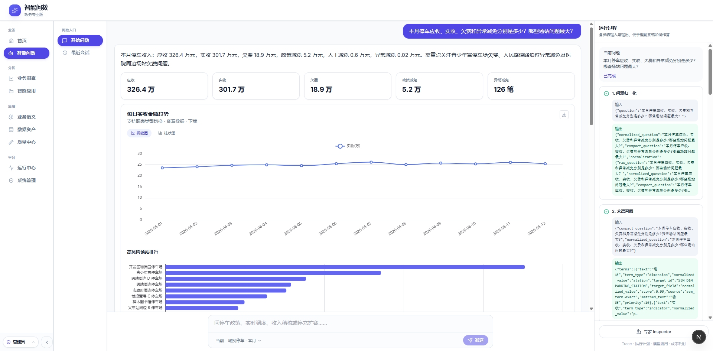
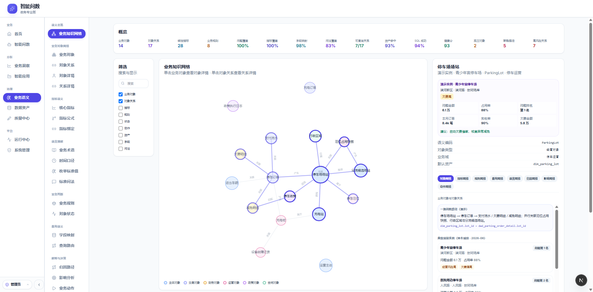
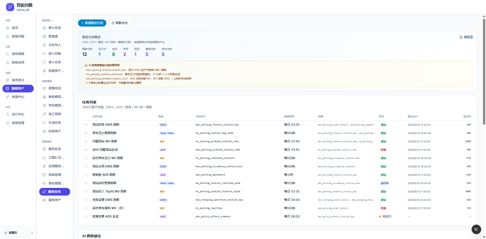

# Agentic BI
[English](#agentic-bi) | [中文](#中文说明)
## 中文说明
**Agentic BI** 是一个面向数据库、Excel 报表、业务系统和企业指标体系的开源智能问数项目。
它不是一个简单的 Text2SQL 工具，而是一个结合 **语义层、本体论、RAG、Text2SQL 和 Agentic Workflow** 的数据分析智能体，目标是让 AI 能够理解业务数据，完成问答分析、归因洞察，并给出可追溯的行动建议。
---
## 产品预览
当前项目处于早期预览阶段。
核心代码正在进行模块化整理、配置脱敏和文档补齐，后续会逐步开源。当前先开放产品 UI、核心设计思路和 Roadmap。
### 1. 自然语言问数
用户可以用自然语言提出业务问题，系统返回结构化答案、图表、推理过程和后续分析建议。

---
### 2. 语义层与业务本体
通过语义层和业务本体，对业务实体、指标、维度、关系和计算逻辑进行建模。

---
### 3. Agentic 分析工作流
Agent 会自动规划分析路径，选择工具，生成 SQL，校验结果，解释推理过程，并生成行动建议。
### 4. 数据治理

---
## 核心概念
### 语义层
Agentic BI 使用语义层将业务概念映射到真实数据结构。
语义层的目标是让 AI 理解业务语言，而不是只理解数据库字段。
---
### 业务本体
Agentic BI 使用业务本体描述实体、关系、指标、维度和业务规则。
通过业务本体，Agent 不仅能理解表和字段，还能理解数据背后的业务含义。
---
### Agentic Workflow
Agentic BI 被设计为一个数据分析智能体，而不是简单的聊天机器人。
一次典型分析流程包括：
1. 理解用户问题
2. 识别业务实体和指标
3. 检索语义定义和本体知识
4. 规划分析步骤
5. 生成 SQL 或调用外部工具
6. 执行查询
7. 校验结果
8. 生成图表和解释
9. 输出洞察结论
10. 给出行动建议
---
## 计划能力
Agentic BI 计划支持以下能力：
* 自然语言问数
* Text2SQL / NL2SQL
* Excel 和电子表格分析
* 语义层管理
* 业务本体建模
* 指标和维度管理
* 多数据源接入
* SQL 生成与校验
* 图表和报告生成
* 异常分析和归因分析
* 行动建议生成
* 基于 RAG 的业务知识检索
* Agentic Workflow 编排
* 可解释、可追溯的数据分析
* MCP 支持，用于外部 Agent 集成
---
## 当前状态
Agentic BI 当前处于早期预览阶段。
我们正在推进以下工作：
* 代码结构整理
* 配置和密钥脱敏
* 示例数据集准备
* 文档完善
* 本体 Schema 设计
* Agent 工作流抽象
* 部署指南
* Demo 环境
---
## 适合关注本项目的人
如果你关注以下方向，Agentic BI 可能值得关注：
* 智能问数
* AI 数据分析
* ChatBI
* Text2SQL / NL2SQL
* 语义层
* 业务本体
* 知识图谱
* RAG
* Data Agent
* Agentic Workflow
* BI Copilot
* 数据治理
* 指标平台
* 可解释 AI
* 决策智能
---
## 参与讨论
核心代码会在优化完成后逐步开源。
在首批代码发布之前，欢迎围绕以下问题参与讨论：
* Agentic BI 应该采用什么样的系统架构？
* 业务本体应该如何建模？
* 语义层和指标平台应该如何协同？
* Text2SQL 结果如何校验？
* Excel 报表和数据库应该如何统一分析？
* Data Agent 如何生成可信的洞察和行动建议？
* 企业级问数系统如何处理权限、口径和数据治理？
欢迎提交 Issue、分享真实业务场景，或关注项目后续 Roadmap。
---
## License
License 会在首批公开代码发布前确定，目标是更开放。
